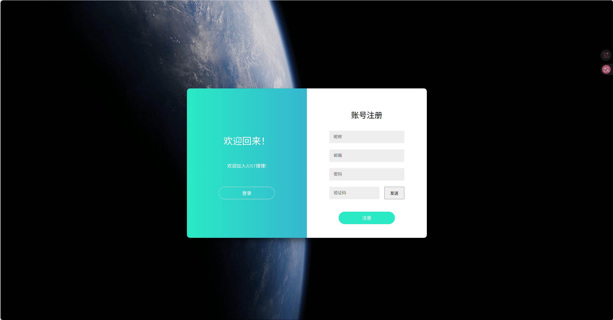
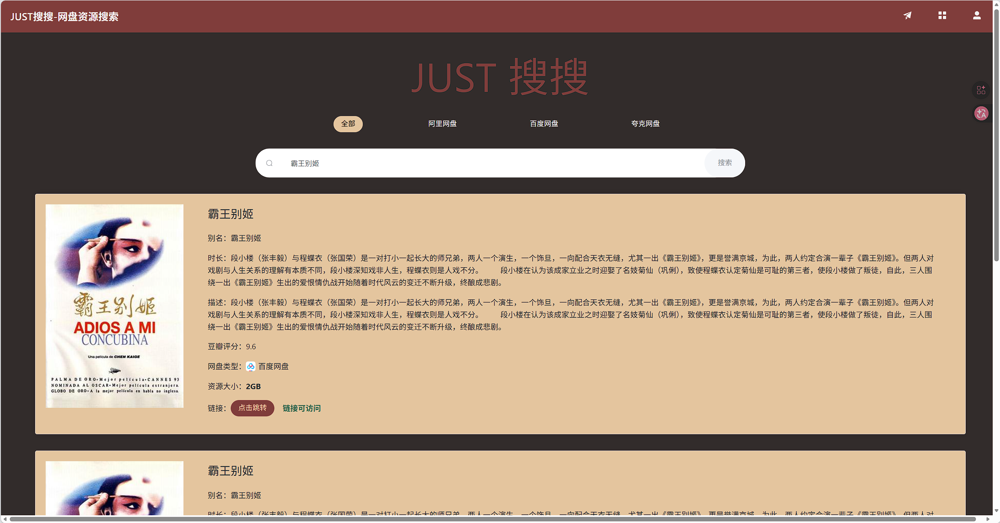
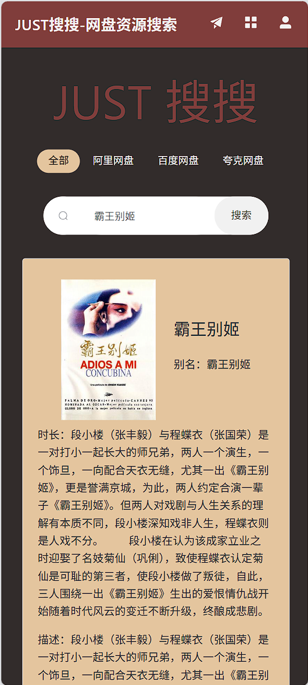
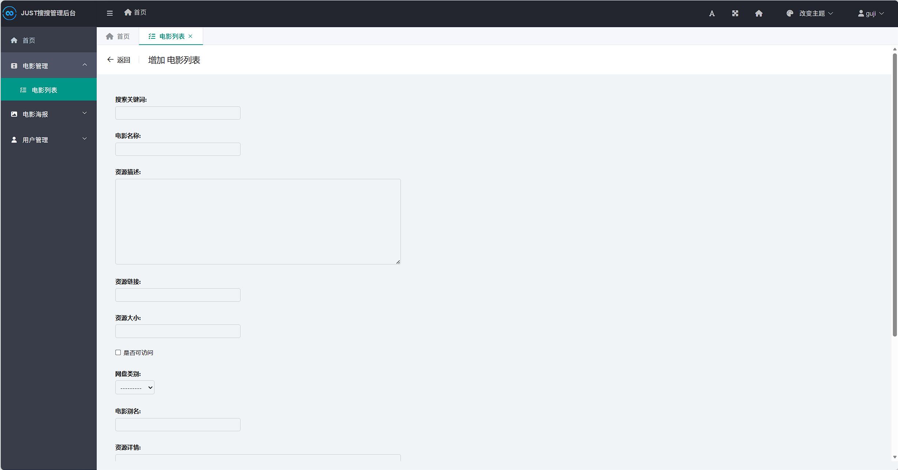
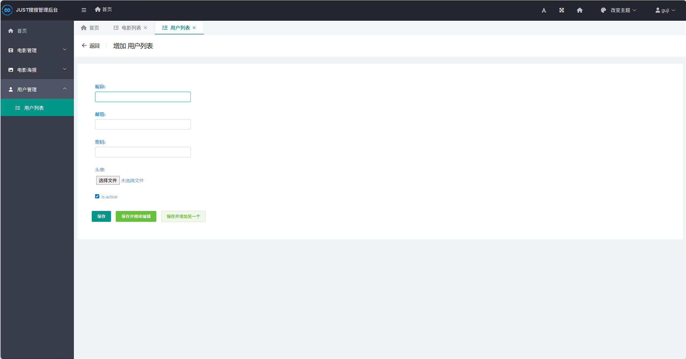
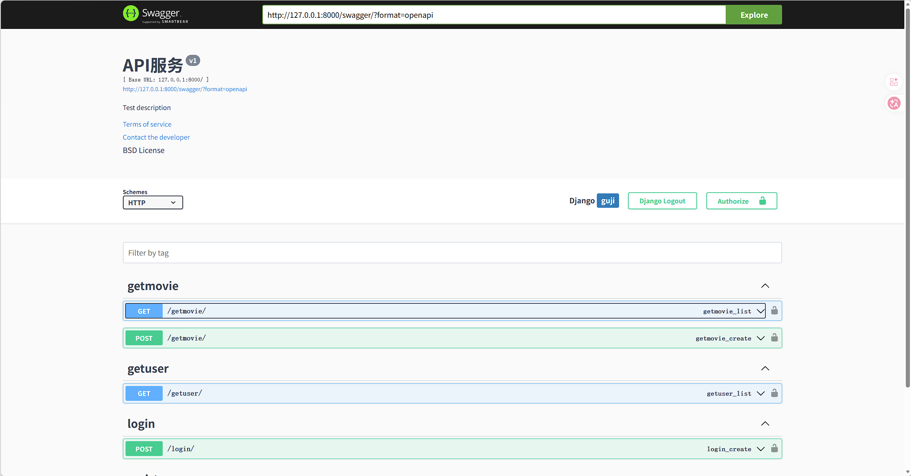

# JUST搜搜 - 电影资源搜索平台

一个基于 Django + Vue.js 的电影资源搜索平台，提供电影信息检索、网盘资源管理和海报展示功能。

## ✨ 功能特性

- 🔍 **电影搜索**：支持关键词搜索电影资源
- 📚 **资源管理**：整合阿里网盘、百度网盘、夸克网盘等多种资源
- 🎬 **海报展示**：电影海报图片管理
- 📊 **豆瓣评分**：展示电影豆瓣评分
- 🔗 **资源链接**：一键跳转网盘资源
- 📱 **响应式设计**：完美支持移动端和PC端
- 🎨 **美观界面**：基于 Element Plus 的现代化界面

## 🛠️ 技术栈

### 后端
- **Django 5.0** - Web框架
- **Django REST Framework** - API开发
- **MySQL** - 数据库
- **SimpleUI** - 后台管理界面
- **Django CORS Headers** - 跨域处理

### 前端
- **Vue 3** - 前端框架
- **Element Plus** - UI组件库
- **Axios** - HTTP请求
- **Vue Router** - 路由管理

### 其他
- **爬虫服务** - 独立的电影数据爬取服务

## 📋 项目结构

```text
Justsoso/
├── Django/                     # Django后端项目
│   ├── Django/                 # 项目配置（settings、urls等）
│   ├── users/                  # 用户管理
│   ├── movies/                 # 电影资源管理
│   ├── movie_poster/           # 海报上传与管理
│   ├── app_auth/               # 登录认证
│   ├── restfulapi/             # API接口整合
│   ├── static/                 # 静态文件
│   ├── templates/              # 模板文件
│   └── manage.py

├── Justsoso_movie/             # 爬虫服务（Flask）
│   ├── main.py
│   └── requirements.txt

├── vue-app/                    # Vue前端项目
│   ├── src/
│   │   ├── components/         # 组件
│   │   ├── views/              # 页面
│   │   ├── router/             # 路由
│   │   └── config/             # API配置
│   ├── public/
│   └── package.json

├── Picture/                    # 图片资源
├── justsoso.sql                # 数据库备份
└── my_vue.conf                 # Nginx配置（前端部署）
```
---

## 🚀 快速启动

### 1️⃣ 克隆项目

```bash
git clone https://github.com/你的用户名/justsoso.git
cd justsoso
```
🗄️ 2️⃣ 数据库配置

创建数据库：
```SQL
CREATE DATABASE justsoso DEFAULT CHARSET utf8mb4;
```
导入数据：
```bash
mysql -u root -p justsoso < justsoso.sql
```
修改 Django 配置：
```bash
# Django/settings.py

DATABASES = {
    'default': {
        'ENGINE': 'django.db.backends.mysql',
        'NAME': 'justsoso',
        'USER': '你的数据库用户名',
        'PASSWORD': '你的数据库密码',
        'HOST': '127.0.0.1',
        'PORT': '3306',
    }
}
```

🖥️ 3️⃣ 启动 Django 后端
```bash
cd Django
pip install -r requirements.txt

python manage.py migrate
python manage.py runserver
```
访问：
```bash
http://127.0.0.1:8000/
```
🧠 4️⃣ 启动爬虫服务（Flask）
```bash
cd Justsoso_movie
pip install -r requirements.txt
python main.py
```
🌐 5️⃣ 启动前端（Vue）
```bash
cd vue-app
npm install
npm run dev
```
访问：
```bash
http://localhost:5173
```
📡 6️⃣ API 文档
```bash
http://127.0.0.1:8000/swagger/
```
⚙️ 7️⃣ 后台管理
```
http://127.0.0.1:8000/admin/
```

## 📸 项目展示

### 🔍 前端页面

#### PC端



#### 📱 移动端适配


---

### 🔐 登录 / 注册


---

### ⚙️ 后台管理系统



---

### 📡 API 文档（Swagger）

